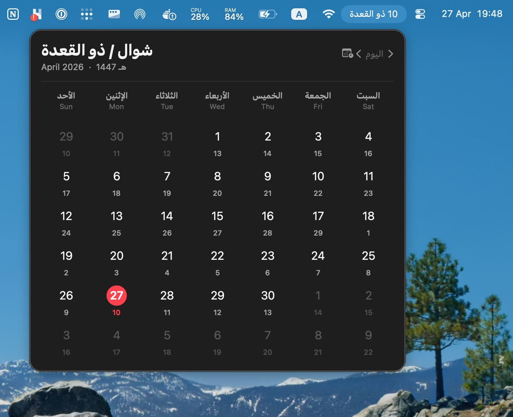
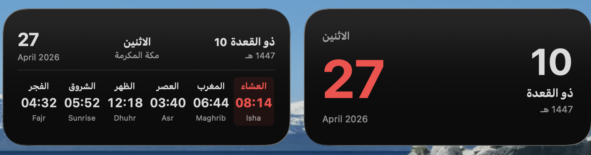
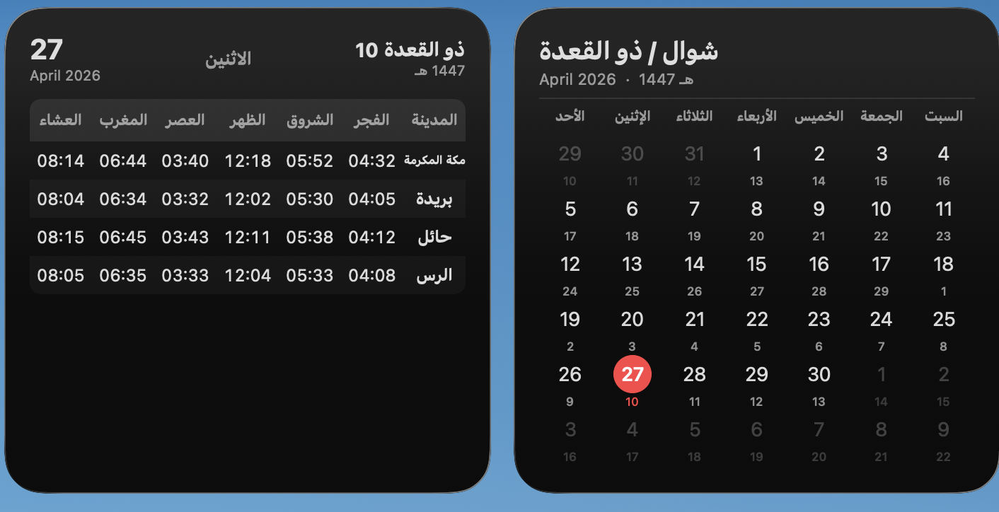

# Hijri Menu Bar

Native macOS menu bar app and home-screen widgets for the Hijri (Umm al-Qura) calendar, with optional prayer-times widgets for Saudi Arabia.

<p align="center">
  
</p>
<p align="center">
  
</p>
<p align="center">
  
</p>

## Features

- **Menu bar** shows today's Hijri date in Arabic (e.g. `١٠ شوال`) and updates automatically.
- **Calendar popover** with a full bilingual month grid, today highlighted Calendar-app style. Navigate with `‹ / ›` or **two-finger trackpad swipe**. Hit the calendar-clock icon to open a "go to date" dialog with a Hijri ↔ Gregorian toggle and number-input fields.
- **Hijri Date widget** — three sizes (medium, large, extra large) with a full month grid showing both calendars side-by-side.
- **Prayer Times widget** — three sizes:
  - **Medium** — your primary city's six prayer times in a row, next prayer highlighted.
  - **Large** — configurable table; pick up to 5 cities to display.
  - **Extra Large** — full Saudi table (15 cities × 6 prayer times), like the printed calendars.
- Prayer times come from the [AlAdhan API](https://aladhan.com) using method **4 (Umm al-Qura, Saudi Arabia)**.
- Pure SwiftUI + WidgetKit + AppIntents. No third-party runtime dependencies.

## Install

### Option 1 — Download a release (easiest)

1. Grab the latest `HijriMenuBar.zip` from the [Releases page](../../releases).
2. Unzip and drag `HijriMenuBar.app` into `/Applications`.
3. The first time you launch it, **right-click the app → Open** (the build is not notarized, so Gatekeeper will warn once).
4. The Hijri date appears in your menu bar. Click it for the calendar.

> **Heads-up about widgets:** Release builds are ad-hoc signed. The menu bar app works fine, but macOS refuses to load app extensions that aren't signed by an Apple-issued certificate. If you want the home-screen widgets to work, build from source (Option 2) — Xcode will sign with your free Apple ID automatically.

### Option 2 — Build from source

Requirements:

- macOS 14 (Sonoma) or later
- Xcode 15 or later (free from the App Store)
- [XcodeGen](https://github.com/yonaskolb/XcodeGen): `brew install xcodegen`

```bash
git clone https://github.com/<your-username>/hijri-menu-bar
cd hijri-menu-bar
./build.sh
cp -R HijriMenuBar.app /Applications/
open /Applications/HijriMenuBar.app
```

`build.sh` auto-detects whether you have a Developer ID certificate. If yes, it signs with that (widgets will load). If not, it uses ad-hoc signing (menu bar works, widgets won't load).

To get a free Apple ID-based signing identity, open Xcode → Settings → Accounts → Add your Apple ID. The "Personal Team" certificate it generates is enough.

### Add the widgets to your desktop

After installing and launching the app once:

1. **Right-click your Desktop → Edit Widgets**.
2. Find **Hijri Menu Bar** in the left sidebar.
3. Drag any size of **Hijri Date** or **Prayer Times** onto the desktop.
4. For the Large prayer-times widget, hover over it and click **Edit Widget** to pick which cities you want shown.

If you don't see your new widgets in the gallery after a fresh install, run:

```bash
killall chronod NotificationCenter
```

…and reopen the gallery. macOS sometimes needs a kick to re-index third-party extensions.

## Configuration

The Large prayer-times widget is configurable via WidgetKit's standard configuration UI (right-click the widget → Edit Widget). The default selection is Makkah, Madinah, Riyadh, Jeddah, Dammam — change it to whichever cities you want, in whatever order. The first city is also what the Medium widget shows.

The Extra Large widget always shows the full preset list of 15 Saudi cities (not configurable by design — it's the "everything" view).

## Tech

- **SwiftUI** for the menu bar popover and all widget views.
- **`Calendar.Identifier.islamicUmmAlQura`** — Apple's built-in Umm al-Qura calendar (the one Saudi printed calendars use).
- **WidgetKit** for the home-screen widgets.
- **AppIntents** for the configurable Large widget.
- **AlAdhan API** for live prayer times (refreshed once per day after midnight).
- **xcodegen** generates the `.xcodeproj` from `project.yml` so source control stays clean.

## Project layout

```
project.yml                       # xcodegen spec — single source of truth for the project
Sources/
  HijriShared/                    # shared by both targets
    HijriDateUtils.swift          # calendar math + formatters
    PrayerTimes.swift             # AlAdhan client + city presets
  HijriMenuBar/                   # menu bar app
    HijriMenuBarApp.swift
    CalendarView.swift
  HijriWidget/                    # widget bundle (.appex)
    HijriWidgetBundle.swift
    PrayerTimesWidget.swift
    CityIntent.swift              # WidgetConfigurationIntent for city selection
Resources/
  HijriMenuBar.entitlements
  HijriWidget.entitlements
build.sh                          # xcodegen + xcodebuild + .app assembly
.github/workflows/release.yml     # CI: builds and attaches a .zip on tag push
```

## Releasing

CI automatically builds and attaches a `.zip` to a GitHub release whenever you push a tag matching `v*`:

```bash
git tag v1.0.0
git push origin v1.0.0
```

The workflow lives in `.github/workflows/release.yml` and runs on `macos-14`.

## License

MIT — see [LICENSE](LICENSE).
